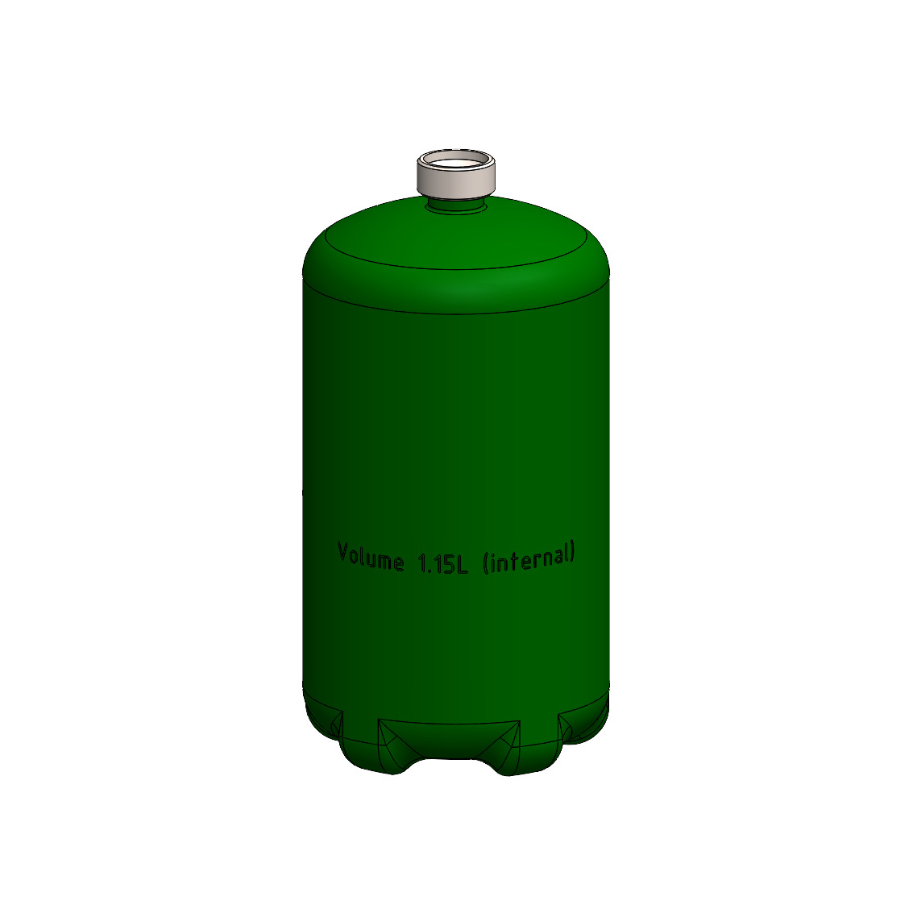

This page will be populated over time with the subjects below.  We want users to find the knowledge needed, the parts needed, and the design components to make their own system.

## Fittings
Let's introduce the most common fittings for DIY pneumatics

## Pressure 
What pressures are practical and safe for prototyping with Pneumatics?

## Storage
Let's demonstrate the basic designs for storing pressurized air.
* volume
* What's safe
* condensation & liquids
* corrosion

_Example: Propane bottle with 1.15L volume_
► Go to GrabCAD files [grabcad_bottle](https://grabcad.com/library/bottle-1003)

## Nozzles
How do we select or design a nozzle to release pressure for a desired intention?
* dusting
* moving pistons
* diffusing pressure
* diffusing sound

## Tubing
What types of tubes are best to work with, given these targets?
* ubiquitous products
* sized for application
* affordable material
* matched to design ideals, so the product matches calculations

## Technical Data
Grab links to helpful technical data here. Sometimes these documents are not available online such as the user manual packaged with the actual product.  

* [PDF fire extinguisher manual](docs/2023.11 Kiddie Manual.pdf) for kiddie household model
* [PDF pneumatics catalog](docs/2023 Catalog - Insterstate Pneumatics.pdf) by Interstate pneumatics
