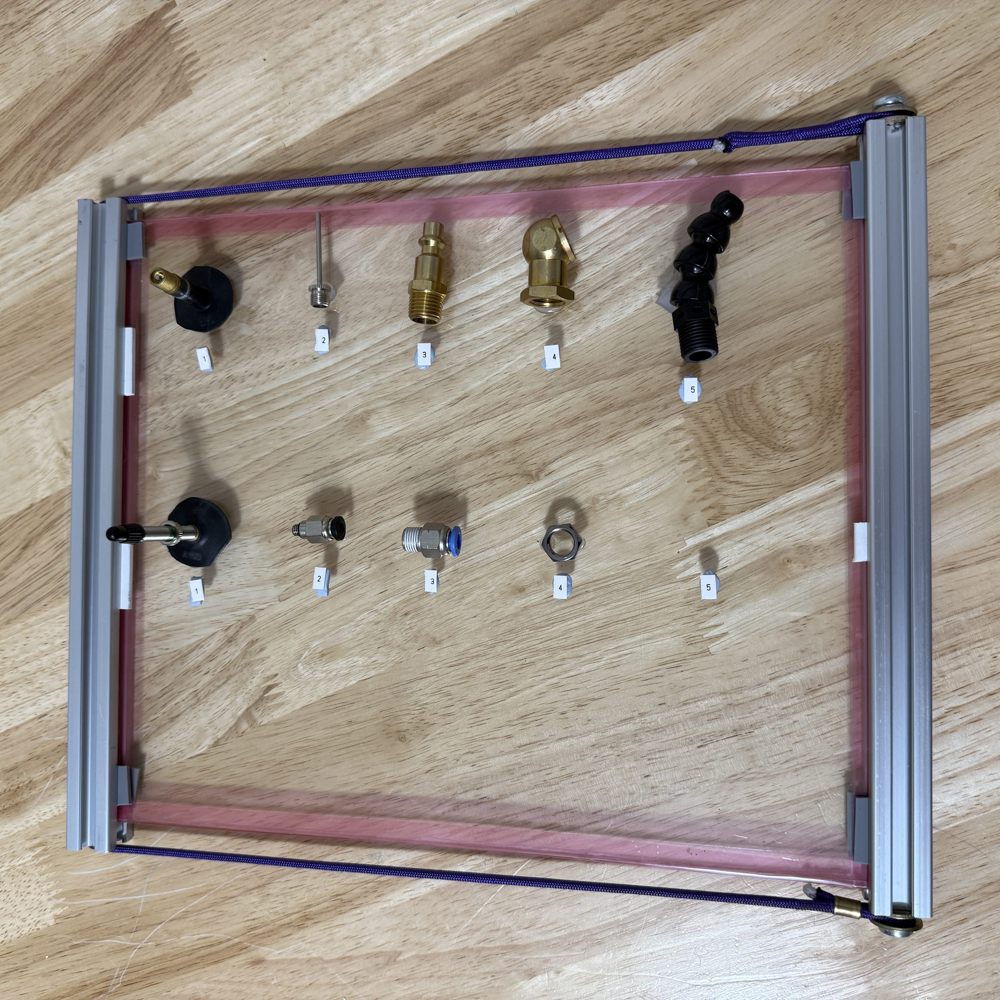
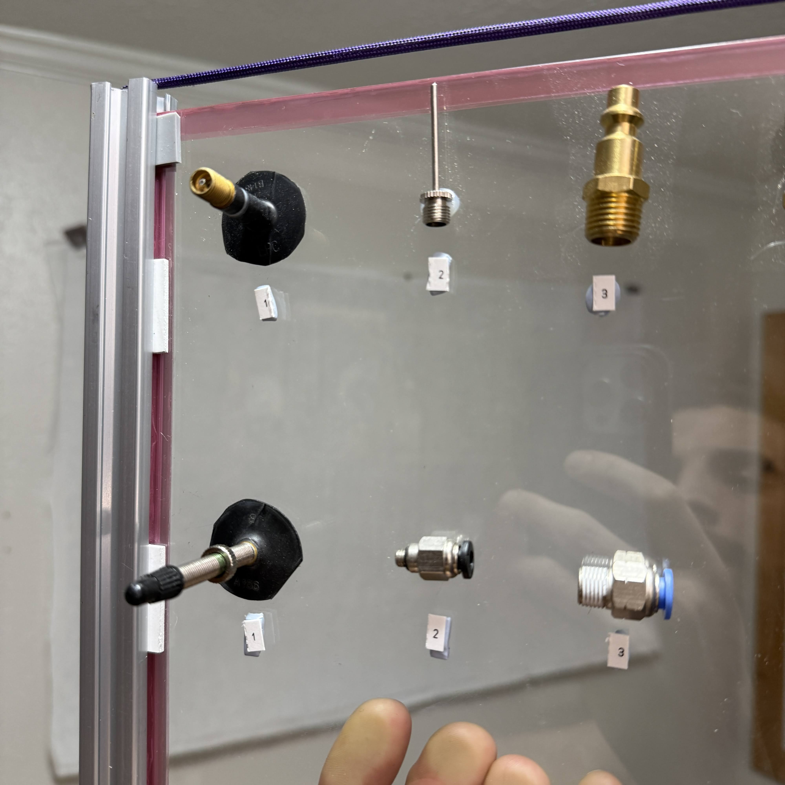
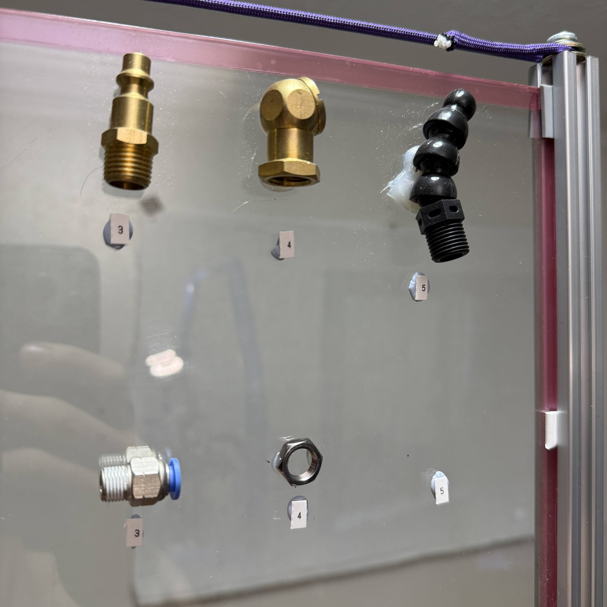

## Air Battery

Portable storage for compressed air up to 200 PSI and maybe more

_These parts give you freedom to store compressed air for small tools, without a compressor._

## USB-C Fan

A common PC fan or similar brushless low-noise fan can be powered with USB (for 5 volts) or USB-C, using 5v, 9v, or 12v.

_These 3 ingredients (plus pd trigger shown) power most small fans._

## Parts-to-know
These are the selected parts as of 2025 that I believe will suffice to cover 80% of all possible inventions.
* know the threads, where they are found, how they measure, how to tap & drill them,
* know the methods to assemble & disassemble, and special tools (like the core removal tool for presta valve)
* know the names for the parts & features, and typical appliances / part-families where they are found.

* 
* 
* 

## More Pics

Coming soon!  We have already built a number of items, they just need some time to be photographed.  Then comes documentation & design info.
