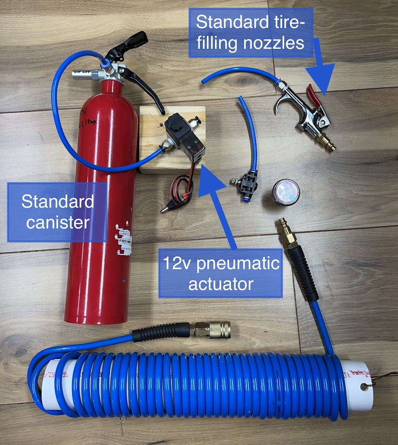
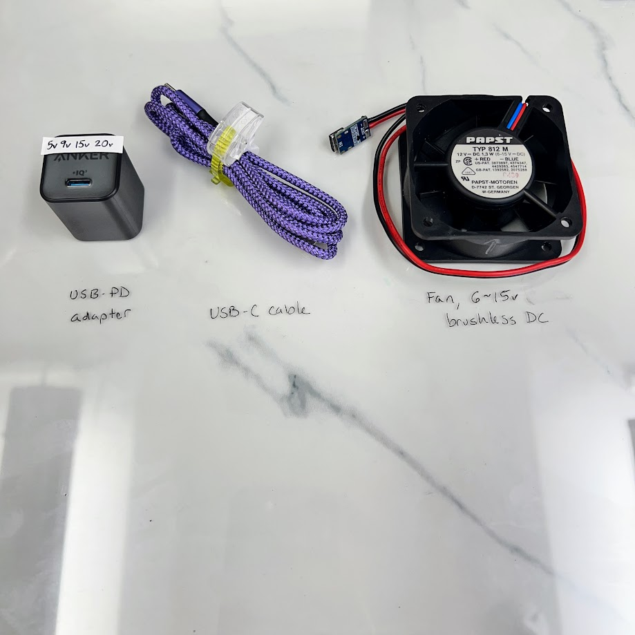

## Air Battery

Portable storage for compressed air up to 200 PSI and maybe more

_These parts give you freedom to store compressed air for small tools, without a compressor._

## USB-C Fan

A common PC fan or similar brushless low-noise fan can be powered with USB (for 5 volts) or USB-C, using 5v, 9v, or 12v.

_These 3 ingredients (plus pd trigger shown) power most small fans._

## More Pics

Coming soon!  We have already built a number of items, they just need some time to be photographed.  Then comes documentation & design info.
