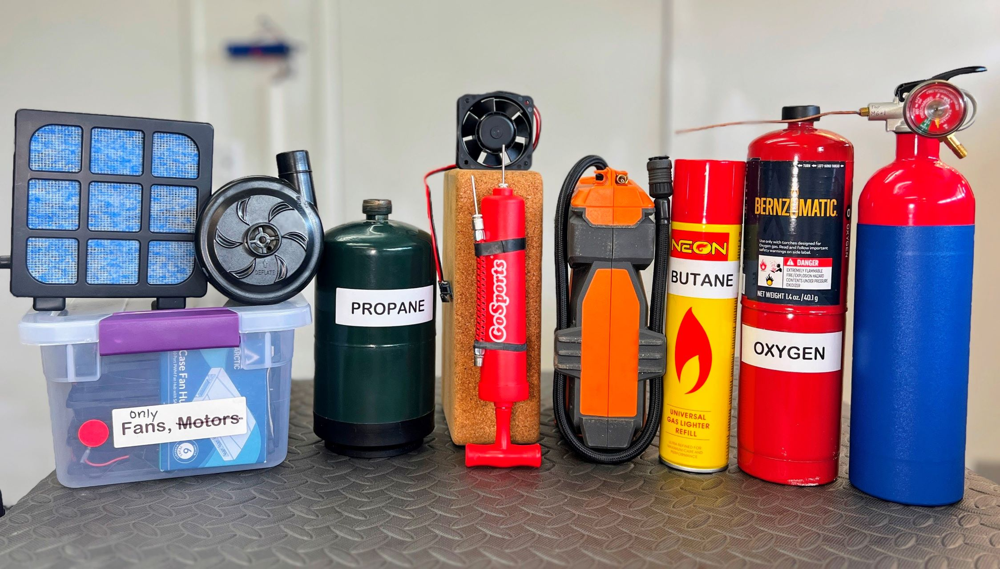

## About?
**What is openair project?**

OpenAir is a collection of solutions for pneumatics design projects, with free designs, available parts, and robust, measurable performance.  Compared with other open-source designs, this project is more digestible for learners of fundamentals.  Here, you'll find modules instead of applications.  Or possibly, full applications from which users can borrow components & concepts to as assets in new projects.

_example items that are planned to be included, in one photo_

## Scope

The intended scope spans as follows:
* compressed gas
* air flow, internal (such as routing to valves)
* air flow external (such as cooling functions)
* adding pressure (such as pumps)
* releasing pressure (such as spraying)
* storing pressure in a fixed place (such as workshop air compressor)
* storing pressure on-the-go (such as a fire extinguisher)

## More
More Open Source designs:

| Project | Link | Purpose |
| ------- | ---- | ------- |
| OpenAir | qr.net/openairproject | take control of air, pressure, & flow with open elements | 
| OpenArm | qr.net/openarmproject | revolutionize robotic arms, a 10-year goal | 
| OpenBox | qr.net/openboxproject | array of open designs beginning with a steel box | 
| OpenGrow | qr.net/opengrowproject | open designs for hydroponics & aquaponics systems | 
| OpenJar | qr.net/openjarproject | array of designs for standard jars, threads, & seals | 
| OpenLab | qr.net/openlabproject | build a laboratory to design & fabricate anything. |
| openME  | qr.net/openmeproject  | full mechanical engineering degree, online for free | 
| OpenSpin | qr.net/openspinproject | array of designs based on parametric bearings | 
| SCUTTLE_Nigeria | qr.net/scuttleafrica | university-level robotics lab in Lagos, Nigeria |

