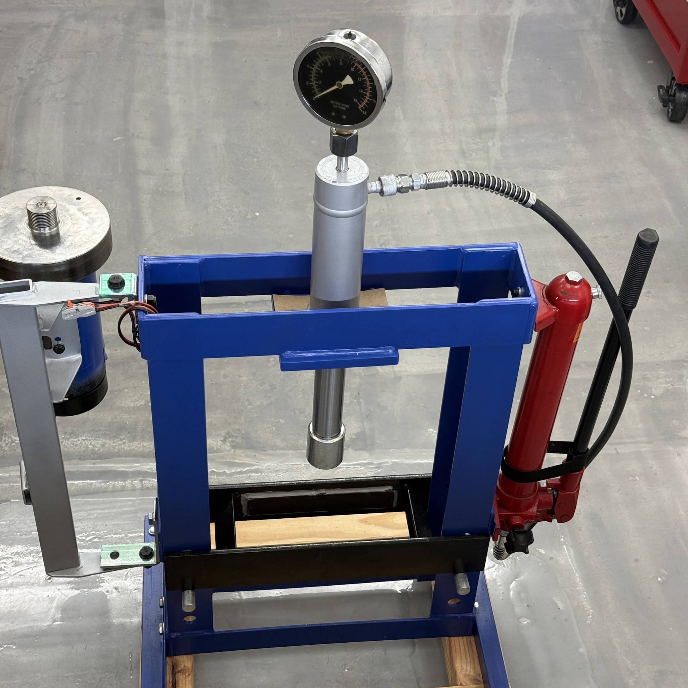
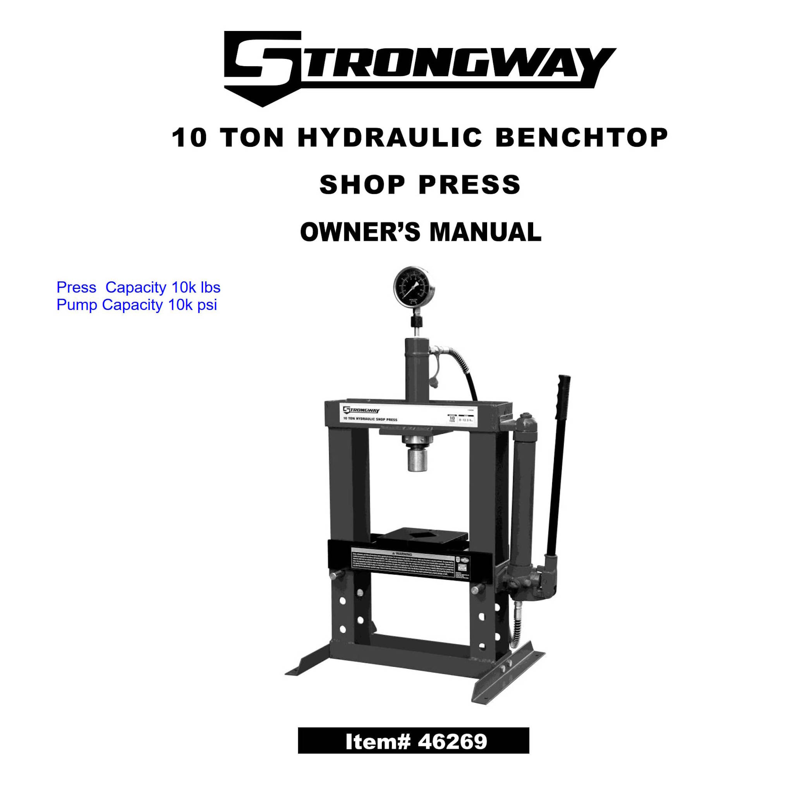
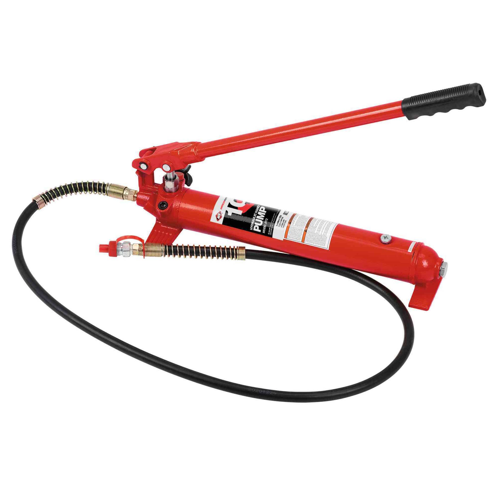

Openair ► Hydro (hydraulics)

_This section is for hydraulic system design.  Documentation will be accumulated here and moved to a dedicated repository when it expands._

## Goals:
Configure a minimal working hydraulic circuit for the 1k-2k PSI range which has a pump, pressure lines, and hydraulic cylinder.  Connect the system to drive the hydraulic press unit at equal or greater speed than the manual operation of the hand-lever pump which was included in the Hydraulic Press setup from 2018.
1. Measure the manual system to establish rough targets.
2. Record key specifications for goals, then source components to upgrade to a rotating pump.
3. Select lines & brackets or design elements to fix the rotary pump as the user desires.
4. Choose components for maximal value and wide availability.
5. Operate the pump in the simplest way available, & measure performance.
6. Summarize key performance metrics & limits for components.
7. Source tools, and combine instructions for required tools.
8. Record any special notes necessary to operate tools & configure the system.
9. Include results, parts, links, and images in the Open Source Repository

- 
- 
- 

## Parts

July 2026:  A simple circuit for hydraulic high pressure system under development.

**PARTS**
The pump comes from a Corolla Power Steering System, (my 1998-2002).  System components come from 2 different system types: hard lines of nicopp material, 3/16 spec and flexible braided lines for p/s aftermarket systems, with AN6 fitting types. 
* Pump Unit, Amazon Link for [Corolla P/S Pump](https://amzn.to/4vJHq0Z) at $69 USD
* Hydraulic lines, [Nicopp brake lines Kit](https://amzn.to/4bOGwZO) with 3/16 OD tubing and threaded flare fittings
* Fittings, [3/16 flare fittings with M10-1 thread](https://amzn.to/3TdB6kM)
* Power Steering Lines [Aftermarket Hi/Lo pressure lines with AN6 fittings](https://amzn.to/3T5mPXq) for aftermarket universal systems.
* Brake Master Cylinder [Master Cylinder 98 Corolla](https://amzn.to/4vC3ASE) about $30
* Banjo Bolt [M16 banjo Bolt](https://amzn.to/4w6GCnO) hi pressure outlet of ps pump

**Concept**

The desired outcome is to use the p/s pump due to its high reliability & low cost, high pressure peak between 1200-2000 psi, and operate this pump below the typical idle speed of 2k RPM.  With a 1.1 ratio between crankshaft and p/s pulley we would expect the high end of RPM near 2k rpm for the pump input, and full pressure available at the pump outlet.  

We will have a lower flow for the system compared with max flow of power steering pump so the large diameter p/s lines are not necessary while the brake lines made from nicopp are universally functional and easy to work with.  Nickel copper lines are near 80/20 copper and nickel with a strength about 5x that of raw copper.  The lines are fitted with a flaring tool and flare nuts, for a compact routing and easy connections with common wrenches.

- 
- 
- 

## Tools

The tools involve some special tools for flare fittings to begin with.
* Tubing Straightener [handheld tool](https://amzn.to/4wOpYZY) uses rollers along x/y directions to sline onto lines and roll them straight.
* Tubing Bender [bending tool kit](https://amzn.to/3RhEWc8) this option is the low-cost end at $32 with capability for single + double flare, no bubble flares.  Comes with (cheap) zinc plated steel tubing.
* Pro Flaring [Kit with dies](https://amzn.to/3R3dU8l) is an option with faster work, vice-mounted flaring tool, with swing arm and dies for single + double + bubble flares, 3 sizes of tubing.

_below, images for simple tubing kit and pro flaring kit_
- 
- 
- 
