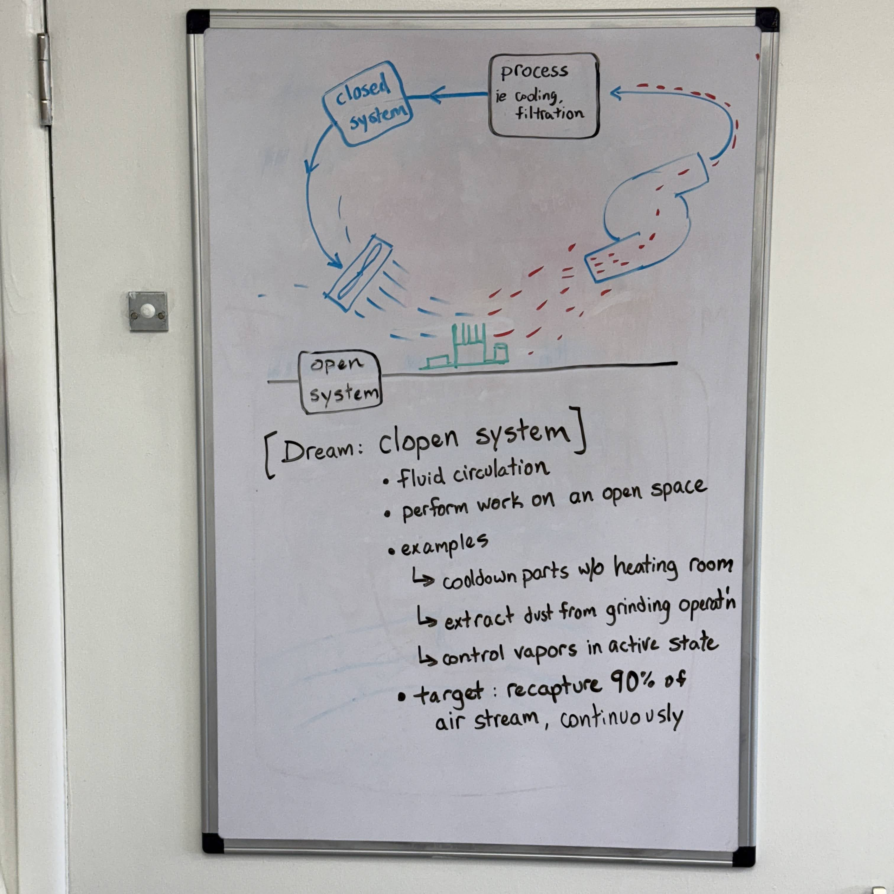
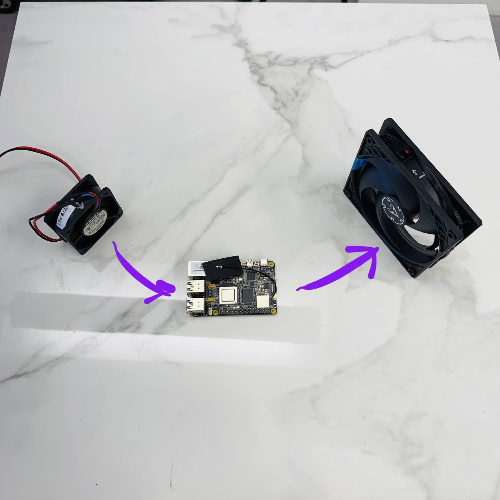
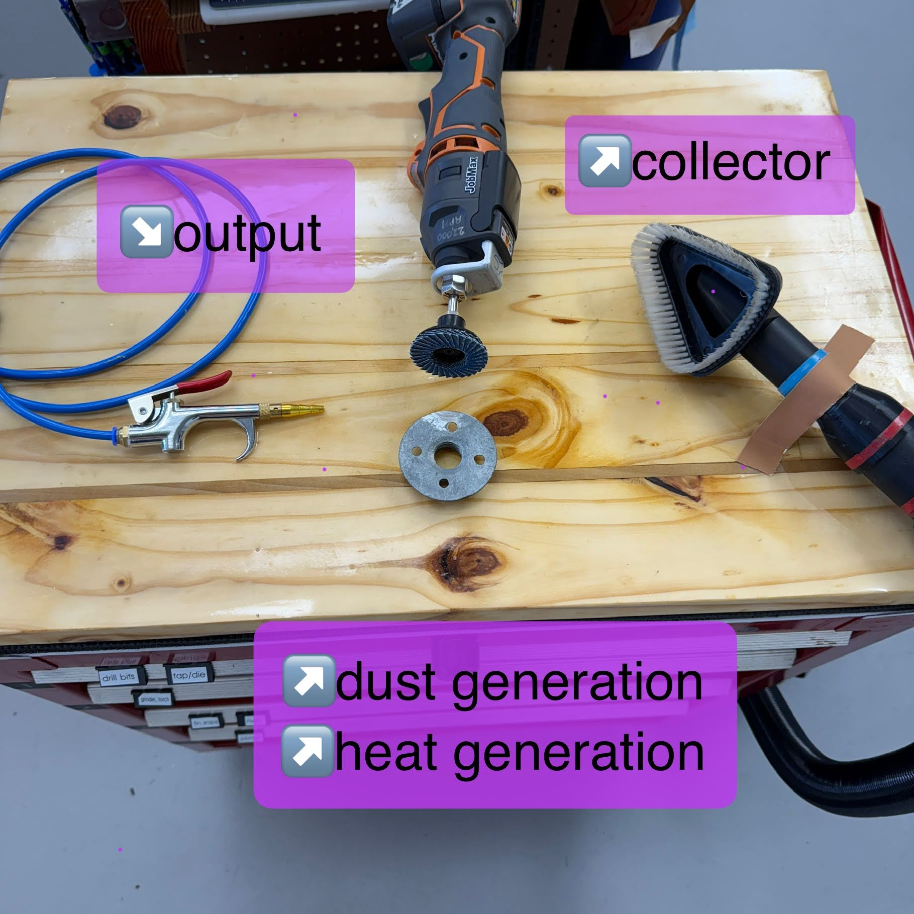

## OpenItems

This page is dedicated to known problem statements for community members.  If the problems are solved, then it yields a guaranteed community value, leveraged in huge ways.  How is it leveraged?  The author of the problem statement must exclusively introduce problems that are well defined, and have existing, measurable enhancements for multiple applications. 

Ideally, the problems are fitted with multiple application cases, fitted with preferred budget range and has existing (potential) ingredients to bake up a solution.  Then, we have identified not only the problem but also the gap.  We have a finer clarity for contributers to compare the problem with their known skillset and decide if they should pursue effort on the solution, with minimal risk of wasting time.

## ClopenAir

Clopen air is just a fun name for the problem statement.  In calculus, a clopen system has a finite bound on one end and an open bound on the other end, or something like that.  The problem statement is that we need to execute cleaning, vapor collection, cooling, etc in many projects without dispersing the heat or debris in its local surroundings. We are seeking a solution that is a METHOD, which prescribes the flow actuators, the system layout, and the best nozzle geometries to make an effective system.  The system is closed in one side and open on the other side, ie the airflow path has a closed channel for tubes and filters or chillers, and an open region where the system does work on an assembly which needs cooling or cleaning, etc.
(latest update 2025.02 by DM)

- 
- 
- 
